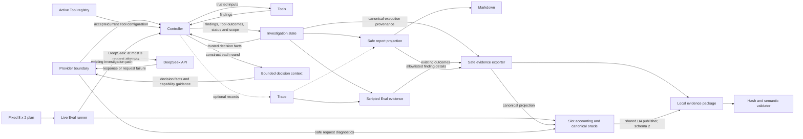

# Game QA Agent

The Agent chooses investigation actions through a provider. Before each decision,
the controller projects trusted state and active Tool capabilities into a bounded
context. It validates proposed actions, builds trusted Tool inputs, and authorizes
scope expansion from checker findings. Deterministic checkers inspect task
dependencies and NPC requirements. The controller records Tool execution outcomes
and links findings to their scope versions.
Trace records optional execution diagnostics; Eval checks deterministic expectations
against the real investigation path. The fixed live-provider evaluation runner is
verified with offline fakes and one formal DeepSeek 8 x 2 run: 15/15 evaluated slots
passed, with 15/16 planned slots having a verified behavioral pass and one Provider
failure remaining unscored. See the [recorded live results](#recorded-fixed-plan-live-run)
for the full accounting and limits.

`build_qa_report(state, trace=None)` produces a typed `QAInvestigationReport` from
the resulting controller-owned state. `render_qa_report_markdown(report)` renders
that snapshot without executing the Agent, provider, or Tools.

## Offline report example

This example reuses the authorized dynamic-scope Eval scenario and real controller
and checkers. Its provider only returns the existing scripted actions. It does not
load environment files or construct a network provider. Run the Python block from
the repository root in an environment with Pydantic 2 and NetworkX installed.

```python
from collections import deque

from game_qa_agent import (
    InMemoryInvestigationTraceRecorder,
    build_default_tool_registry,
    build_deterministic_evaluation_cases,
    build_qa_report,
    build_task_index,
    render_qa_report_markdown,
    run_agent_investigation,
)


class OfflineProvider:
    def __init__(self, actions):
        self.actions = deque(actions)

    def generate_next_action(self, context):
        return self.actions.popleft()


case = next(
    case for case in build_deterministic_evaluation_cases()
    if case.case_id == "authorized_dynamic_scope_expansion"
)
trace = InMemoryInvestigationTraceRecorder()
state = run_agent_investigation(
    case.initial_state.model_copy(deep=True),
    build_default_tool_registry(),
    build_task_index(case.tasks),
    case.runtime_state,
    OfflineProvider(case.scripted_actions),
    max_steps=case.max_steps,
    trace_recorder=trace,
)
print(render_qa_report_markdown(build_qa_report(state, trace)), end="")
```

The report tests execute this example and compare its complete output:

```markdown
# QA investigation report

Status: `finished`.

Trusted scope (version 2): `task_a`, `task_b`, `task_event_7`.

Findings: 3 recorded; 0 unrecognized.
Decision errors: 0.

## Findings

Type | Count
--- | ---
NPC location mismatch | 1
NPC occupied by another task | 1
Potential NPC conflict (static risk) | 1

Scoped details (one row per recorded recognized finding):

Type | Tasks in scope | Other task references | NPC references
--- | --- | --- | ---
NPC location mismatch | `task_b` | 0 | 1
NPC occupied by another task | `task_b`, `task_event_7` | 0 | 1
Potential NPC conflict (static risk) | `task_b`, `task_event_7` | 0 | 1

## Trace

Recorded steps: 4; final status: `finished`; rejected steps: 0; scope changes: 1.

- Step 2: scope 1 -> 2; added `task_event_7`.

## Limitations

- Counts reflect recorded findings; full checker coverage is not established.
- A potential NPC conflict is a static risk, not proof of a runtime conflict.
- Trace is diagnostic and may omit steps.
```

## Report contract and boundaries

The report captures normalized investigation status, sorted trusted scope and scope
version, total recorded findings, recognized issue-type counts, safe per-finding
references, unrecognized-finding count, decision-error count, and fixed limitation
codes. An optional Trace summary adds recorded step count, final status, rejected
step count, and scope-version changes with added IDs filtered to the final scope.
Unrecognized status text becomes `unknown`; missing or inconsistent Trace final
status is reported without changing the investigation status.

Only the seven existing issue types paired with their expected checker names get
details. Per-finding task IDs must belong to `state.scope_task_ids`. Other task IDs
and NPC IDs become distinct reference counts per finding. These are counts of the
issue's ID lists, not counts extracted from its evidence dictionary. There is no
complete current-scope NPC allowlist in the existing state, so NPC names are not
exported. Checker messages and all evidence values, including locations, runtime
states and missing dependency IDs, are omitted. Unknown issue/checker pairs stay
in the total and unrecognized counts without exporting their labels or payloads.

Provider reasons, prompts/completions, raw actions and Tool arguments/results,
decision-error strings, candidate expansion IDs, and environment data are never
copied. The only variable text exported from inputs is the controller's current
trusted task IDs. Markdown keeps those labels inside single-line code spans.
This boundary assumes controller-owned state and a recorder from the same run;
it does not authenticate forged state or identify secrets placed inside trusted
task IDs. Trace has no run identifier and may be incomplete because recording
failures do not affect investigation execution.

The report preserves recorded finding multiplicity, even when omitted payloads
make two projected details identical. It does not infer severity, root cause,
checker coverage, or QA pass/fail. `finished` records an Agent stop; a potential NPC
conflict remains a static risk. Clarification, human review, step exhaustion, and
unfinished or unknown statuses have explicit limitations. The report does not
export Tool execution records or their finding/scope links; finding details are
still filtered against the final trusted scope.

The implementation copies collections and performs no I/O. Output uses stable
ordering and LF newlines without timestamps. It adds a downstream consumer only:
Agent/controller/Tool, provider, scope, Trace and Eval behavior are unchanged by
reporting.



## Provider decision context and active Tools

`run_agent_investigation` calls `build_provider_decision_context(state, registry)`
before each Agent round. Providers now implement
`generate_next_action(context: ProviderDecisionContext) -> NextActionSpec`.
`DeepSeekProvider` requires that context type; passing an investigation state is
an error. Scripted providers use the same boundary. Context models are frozen and
use tuples for nested collections, so the provider receives a detached snapshot.

Provider-visible fields | Meaning and bounds
--- | ---
`investigation_goal`, `goal_truncated` | Up to 2,000 goal characters, with an explicit truncation flag.
`scope_task_ids`, `omitted_scope_task_count` | Up to 128 unique sorted trusted scope IDs. IDs longer than 128 characters are omitted, never shortened into different identifiers.
`expandable_task_ids`, `omitted_expandable_task_count` | The same bounds applied to currently controller-authorized expansion candidates.
`scope_version`, `investigation_status` | Current version and a fixed status vocabulary; unrecognized status text becomes `unknown`.
`active_tools` | Sorted active registry names, each with `blocked_by_call_history` and `last_called_scope_version` (or `None`). Only the latest version at or before the current scope is included.
`finding_counts`, `unrecognized_finding_count` | Counts for the seven existing finding-type labels plus a count of unknown labels; no per-finding payloads or references.
`decision_error_count`, `last_decision_rejection` | Historical error count and one fixed code for the most recent controller rejection, or `None`.

The context excludes impact-analysis payloads, raw issue messages/evidence,
checker names and issue task/NPC references, raw decision-error strings, inactive
or rejected Tool names, rejected expansion IDs, full Tool inputs/results, Trace,
Eval, Report, Tool execution records, provider-failure diagnostics, and
credentials/environment fields.
Finding counts summarize recorded type labels; they do not authenticate checker
identity or prove coverage, severity, or that static risks occurred at runtime.

`AgentInvestigationState.last_decision_rejection` holds feedback across rounds.
The controller assigns one of `missing_tool_name`, `unexpected_action_fields`,
`tool_already_called`, `unknown_tool`, `no_expandable_tasks`,
`empty_scope_expansion`, or `unauthorized_scope_expansion` at the corresponding
rejection branch. Processing the next proposal clears it before that proposal is
checked. Existing `decision_errors` strings and accumulation remain unchanged.
Older state with only raw error strings supplies an error count without an
inferred rejection code; error text is never parsed to reconstruct feedback.

Active capabilities come from `ToolRegistry.active_tool_names()` on the registry
used by the controller for that investigation. Registration and trusted input
construction share one supported input-contract map in `tools.py`. Registration
rejects a Tool name without a trusted input contract; direct invalid edits to the
public registry also fail when capabilities are requested, rather than silently
advertising or hiding an unusable Tool. Removing an active Tool or switching to
another supported Tool changes the next context without editing provider prompts.
The call-history rule is shared with controller execution, including the existing
conservative handling of legacy calls with no recorded scope version.

Capability visibility is guidance, not authorization. The controller still checks
the current registry, call history, action fields, and authorized expansion IDs at
execution time. A stale or forged context cannot grant permission. The registry
currently supports the four existing named Tool input contracts; adding another
requires an explicit trusted input contract. Registered implementations must honor
their contract; the registry does not prove arbitrary callable behavior correct.

DeepSeek system instructions are fixed local text. Goal text, IDs, capabilities,
and summaries appear only in the user-message JSON. The context is serialized once
per provider decision and reused for request retries. Completion acceptance,
normalization, retry/fail-fast policy, and Agent step accounting are unchanged.
Trace stays passive, Eval uses the real controller path, and Report stays read-only.

The projection does not mutate state or registry and performs no I/O. Size bounds
are character and collection limits, not token budgets; no token or cost reduction
has been measured. Omitted context can reduce the provider's ability to decide;
the prompt directs it toward clarification or human review when needed. Tool
execution still uses the full controller-owned scope, including IDs omitted from
the provider view. The goal and visible trusted IDs are intentional input text,
not automatically secret-redacted or authenticated against forged caller state.

Run `python -m pytest -q tests/test_provider_context.py` for the context checks.
They cover request privacy, immutability, deterministic bounds, active configuration,
controller authority, rejection feedback, and dynamic scope without network calls.
Baseline fingerprints verify identical pre-existing business state, Trace, Eval,
Report, and Markdown for all four deterministic scenarios, excluding the additive
rejection-code and Tool-execution fields. Provider reliability tests also verify
identical bounded context across retry attempts. The existing offline report
example still matches its output.

These tests do not establish live-provider decision quality or production readiness.

## Controller-owned Tool execution evidence

`AgentInvestigationState.tool_executions` records actual authorized invocations,
independently of optional Trace. Each frozen `ToolExecutionRecord` contains a
one-based `execution_number`, the trusted active `tool_name`, the `scope_version`
at invocation, `status` (`succeeded` or `failed`), and `issue_indices`: zero-based
links into this run's `state.issues`. The identity comes from the dispatched Tool,
not a finding's self-reported `checker_name`. No exception text, Tool payload,
timestamp, or provider data is copied into these records.

In a fresh controller-owned run, no record for a Tool/version means it has not
run. A succeeded record with no issue links explicitly records an empty result;
a failed record records an execution failure, including any findings already
yielded before that failure. Equal findings remain deduplicated in `state.issues`,
and each execution that returns them links to the existing index. This preserves
which executions and scope versions produced findings without changing findings.

Tool exceptions still propagate. Failed attempts remain subject to the existing
same-scope call-history block; rejected proposals produce no execution record.
No Tool retry, session recovery, or requirement to run every active Tool before
`finish` is added. The provider already gets call-history guidance; these internal
records do not enter Context, Trace, the scripted Eval's observation model, or the
QA Report. The evidence-package projection exports their safe fields and finding
links; the live Eval oracle uses them to verify required executions. Report
completion still means the investigation stopped, not that QA passed or coverage
is complete.

Links rely on the controller's append-only issue ordering. Caller-seeded findings
and older states with call history but no execution records have unknown execution
provenance; outcomes are not reconstructed from empty findings or Trace. Records
do not authenticate caller-forged state and are not a persistence or crash-recovery
mechanism. Report still summarizes recorded findings without exporting execution
outcomes or certifying their coverage.

`tests/test_projection_fields.py` classifies every relevant upstream Pydantic field
at the Context, Trace, Report, and evidence-package boundaries as exposed, summarized/derived, or
internal-only. New fields require a conscious test update; explicit runtime
allowlists remain the safety boundary. Cross-round tests cover repeat rejection,
authorized expansion and rerun through the final Report, Trace on/off/failure,
separate investigations, and step-limit prefixes. Existing tests already cover
safe rejection recovery and transient request recovery through the real Tool loop.

## Local offline evidence package

`game_qa_agent.evidence.run_evidence_package("offline-evidence-001")` runs the four
existing deterministic cases into a new directory and returns a validated typed
package. `read_evidence_package("offline-evidence-001")` reopens and validates it
without running the Agent. The runner also accepts a list of trusted, non-sensitive
`AgentEvaluationCase` definitions with unique string case IDs and fresh initial
states. Case IDs use `[A-Za-z0-9][A-Za-z0-9_.-]{0,127}`; trusted task IDs are never
abbreviated. It reuses the existing Eval execution and expectation checks; it does not
construct DeepSeek, load environment files, or call a network provider.

Schema 1 has exactly four published artifacts:

- `plan.json`: frozen before any case executes; run UUID, actual full Git HEAD and
  dirty flag at planning time, Python/Pydantic/NetworkX/OpenAI versions, planned
  case slots, explicit repetition 1, fingerprints, oracle expectations, active
  default Tools, step limits, Trace configuration, initial scope, and safe scripted
  action structure. Unknown action names/IDs become a marker/count; args become
  a presence flag. Reasons and raw arguments are excluded even from hash input.
- `results.json`: one result per planned slot, with separate execution, evaluation,
  and evidence states. Required evidence includes canonical final status/scope,
  decision-error count, trusted Tool execution records and finding links. Findings
  reuse the Report allowlist in canonical issue order; unknown pairs retain an
  indexed placeholder, and equal safe projections are not merged. Indices refer
  only to the finding array in that result's run/case slot.
- `report.md`: derived only from those results, including planned/evaluated/pass/
  fail/harness counts and evidence completeness. A zero behavioral denominator is
  `N/A`. A Tool failure can have complete evidence of its partial failed execution
  while remaining `harness_error / unscored`.
- `manifest.json`: published last, with run identity, completion marker, and exact
  byte size/SHA-256 for the other three artifacts. Without it the reader reports
  `incomplete`. The manifest does not hash itself.

Run identity, case content identity, and artifact hashes have distinct purposes.
Canonical JSON uses sorted string keys, UTF-8, compact separators and a final LF;
unsupported objects, non-string keys and NaN/Infinity are rejected. The fixture
digest covers explicit trusted Task/runtime fixture fields, not Tool observations.
The case fingerprint binds that digest, the safe scripted configuration and oracle;
changing fixture/expectations changes it, while run ordering does not. Ignored
private action text is deliberately outside this identity. Fixture values must
already be non-sensitive: hashing is not secret redaction. Fixture contents and
source patches are not archived, so this is not a self-contained replay package.

The reader checks schemas, sizes/hashes, run identities, exact unique slot sets,
fingerprints, expectation consistency, canonical execution/finding references,
and the derived Markdown. Missing canonical evidence cannot certify a behavioral
pass. Trace contributes only optional count/status diagnostics; existing cases
may explicitly check Trace expectations, but Trace never supplies provenance.
Raw state, messages/evidence payloads, arbitrary rejected IDs, provider text,
exception text/types/tracebacks and raw Trace objects are not exported.

Each file uses a same-directory temporary file, flush, file fsync, then replace.
Publication succeeds only after disk readback validation; required write or
validation failure raises and leaves an incomplete diagnostic directory. Existing
directories are never reused. Files can be visible after an unsuccessful call;
manifest cleanup is attempted on failure. Directory durability is explicitly not
confirmed. Hashes detect modification against a manifest, not a coordinated forged
package; no signing or source authentication is claimed. A dirty flag does not
identify the exact uncommitted patch. Completion does not imply QA pass, full Tool
coverage, archived model conversations, or live-model quality.

`tests/test_evidence_package.py` verifies disk round-trips, corruption, cross-run and
slot mismatches, canonical provenance, privacy canaries, and injected write/fsync
failures offline. This supports discussing verifiable local evidence, honest case
accounting, and safe exports; it does not establish production durability.

## Fixed-plan Provider Eval

`game_qa_agent.live_eval.run_live_evidence_package(directory, provider_factory=...)`
freezes eight local cases with two independent repetitions each, then runs the
existing controller and Tools. The factory receives a safe planned slot and must
return a fresh provider for that slot. There is no implicit DeepSeek construction
or environment-file loading. The default `validation_only=True` labels fake/scripted
infrastructure checks; it is a caller declaration, not a network sandbox. The tests
use injected providers and HTTPX MockTransport under network/DNS/environment-file guards.
A real run must explicitly supply DeepSeek providers and set `validation_only=False`.
The formal run recorded below used this path; smoke/preflight results are excluded
from its 16 planned slots.

Case | Required behavior (each repeated twice)
--- | ---
`missing_dependency` | Execute the dependency reference checker and report its finding.
`dependency_cycle` | Execute the cycle checker on the cyclic fixture.
`runtime_no_findings` | Execute the runtime checker before accepting a zero-finding result.
`dynamic_expansion` | Runtime check, authorized expansion, then static conflict check at scope version 2.
`expanded_scope_rerun` | Run the runtime checker at versions 1 and 2 around authorized expansion.
`active_tool_selection` | Use the active reference checker despite inactive/unknown Tool suggestions.
`scope_boundary` | Check only trusted scope despite a suggestion to include an unauthorized task.
`bounded_incomplete` | Execute the required checker within one decision; retain `max_steps_exceeded`.

The last case expects correct incomplete behavior, not investigation completion.
All other cases have an eight-decision limit. No oracle requires the provider to
make an intentionally invalid proposal. Checks compare canonical final status,
issue types, scope and rejection count using Eval's existing comparison primitive,
and require succeeded controller-owned Tool records at specified scope versions.
Self-declared completion, empty findings, Provider reasons and optional Trace cannot
replace those records. These deliberately narrow tasks test specified behavior,
not general autonomous QA performance.

The plan is written before provider setup. Every one of its 16 slots is initialized
before execution. Results distinguish `completed`, `provider_failure`,
`harness_failure`, and `not_started`; evaluation is `passed`, `failed_behavior`,
or `unscored`. Quota/billing, non-retryable provider failures, and harness failures
stop later slots, which remain `not_started`. Exhausted transport/rate-limit and
invalid-response failures stay unscored and advance to the next planned sample.
The runner never retries a case. Tool/internal errors are harness failures, even
if a Tool raises a ProviderError; partial findings retain failed execution links.

The same slot table determines structured accounting and Markdown: planned,
attempted, completed, evaluated, pass/fail, unscored, Provider categories, harness
failures, not-started and evidence completeness. Both `pass / evaluated` and
`verified pass / planned` are shown; zero denominators are `N/A`. Protocol-invalid
completions retain `invalid_response` and remain visible outside the behavioral
denominator. `completed` means the controller returned, not that QA passed.

Decision identity is `(run_id, case_id, repetition, logical_decision)`. Request
attempts/retries come only from safe DeepSeek diagnostics, including successes;
unknown counts on other injected providers are `null`. Known request totals are
reported alongside the count of decisions whose request count is unknown.
Request retries remain inside one decision and cannot add slots or Tool executions.

The plan binds provider identity, requested `deepseek-v4-pro`, 30-second timeout,
three project attempts, SDK retries 0, repetition count, per-case step limits,
and `none` for fallback/cache. Effective SDK timeout/retries are checked before
execution and each decision. Returned model identity is retained only when it
matches the locally recognized model; absent/unrecognized values are `null`.
No credential, URL, raw header, exception text, completion, Tool payload or rejected
ID enters the package. Source/runtime identity and fingerprints bind trusted local
fixtures, goals, oracle and active capabilities; they are not secret redaction.

Live packages use schema 2 because schema 1 fixed offline mode, repetition 1 and
offline execution states. Existing schema 1 packages remain readable without
migration. Both schemas share the four H4 files, atomic file writes/fsync,
manifest-last publication, hash/run/slot validation and canonical projections.
The reader rechecks oracle consistency and required Tool evidence. A complete
package can honestly account for unstarted slots with incomplete execution evidence;
it cannot certify them as behavioral passes. Missing/invalid required evidence for
an attempted slot aborts publication. Trace is neither required nor reconstructed.

The live Eval runner adds no Agent authorization changes, new checker, model judge, fallback,
response cache, replay, persistence service or new dependency. It retains H4's
unsigned-integrity and file-durability limitations and the Provider's per-operation
timeout, without an overall run deadline. Interrupted publication is incomplete;
there is no resume. Run `python -m pytest -q tests/test_live_eval.py` for offline
acceptance. The recorded live run below supplies observations for this fixed plan,
not a general reliability or cost estimate.

### Recorded fixed-plan live run

The formal run used DeepSeek / `deepseek-v4-pro` on source commit
`5c8d179f7ad357950494ae921fb60cbce09e9b98`, with `source_dirty=false`.
Its schema 2 run ID is `7175f92fdb9a4061953e0651e6fab68b` and
`validation_only=false`. This identity belongs to the executed code revision;
later documentation commits do not change it.

All eight cases above had two preplanned repetitions. The plan was frozen before
provider setup, with no reroll, best-of-k, or changes to cases, oracle, prompt,
Tools, scope, retry rules, or failure policy during the experiment.

Measure | Recorded result
--- | ---
Provider / returned model | DeepSeek / `deepseek-v4-pro`
Planned / attempted slots | 16 / 16
Completed slots | 15
Evaluated / behavioral pass / behavioral fail / unscored | 15 / 15 / 0 / 1
Behavioral pass / evaluated | 15/15 = 100%
Verified behavioral pass / planned | 15/16 = 93.75%
Provider failures | `invalid_response` x 1
Harness failures / not_started | 0 / 0
Required evidence complete / incomplete | 16 / 0
Logical decisions | 39
Known request attempts / retries | 39 / 0
Decisions with unknown request counts | 0

The sole unscored slot was `runtime_no_findings`, repetition 2. Its first decision
successfully executed `npc_runtime_checker` at scope version 1, leaving a succeeded
zero-finding `ToolExecutionRecord` with empty `issue_indices`. The second decision
was rejected as `invalid_response`; final canonical status remained `running`.
Under the frozen policy this is `provider_failure / unscored`, not a behavioral
failure. The record is complete evidence of the partial investigation, not a
completed investigation or a behavioral pass. No product bug was confirmed;
the retained safe category does not establish the specific response rejection cause.

Schema 2 publication validation and independent reader validation both passed,
including artifact hashes, exact slot identities, canonical finding/execution
references and derived Markdown. The four run artifacts are retained outside the
Git working tree, not bundled with this README. They contain safe projections,
not raw completions, Provider reasons, Tool payloads, credentials or exception text.

These are descriptive results for eight narrow fixtures with two repetitions
each, not a statistically significant estimate of model generalization or
production reliability. The 100% figure applies only to evaluated slots; verified
behavioral pass across the planned set is 93.75%. Complete evidence is not full QA
coverage, and `finished` is not QA pass. This run observed no request retries, so
retry/fail-fast edge cases remain supported by deterministic offline regressions.
No operational cost, token saving, production readiness or broad QA capability
claim follows from this run.

## Provider request reliability

`DeepSeekProvider` owns a small request retry policy. Each
`generate_next_action(context)` call permits at most three SDK requests: an initial
attempt and two retries, with waits of 0.5 and 1 second. SDK retries are explicitly
disabled (`max_retries=0`), so nested retries cannot multiply that budget or retry
quota errors before the provider classifies them. The same decision context and
request parameters are reused. There is no Agent/session recovery loop.

The SDK client explicitly sets `timeout=30.0`, which reaches the HTTP request as
30-second connect, read, write, and pool timeouts. These bound network operations,
not the total elapsed duration of a decision. Timeout errors use the same existing
`transport_service` classification and request budget.

Failure category | Request behavior
--- | ---
`transient_rate_limit` | Ordinary HTTP 429 retries within the budget.
`quota_billing` | HTTP 402 or recognized quota, billing, subscription, usage-limit, or insufficient-balance/credit signals fail immediately, including HTTP 429.
`transport_service` | SDK connection/timeouts and HTTP 408, 409, 500, 502, 503, 504 retry within the budget. Other 5xx statuses fail immediately.
`invalid_response` | SDK response decoding/validation errors or rejected completions fail immediately.
`non_retryable` | Remaining SDK API failures, including authentication and invalid requests, fail immediately.

Quota detection inspects SDK code/type fields and the code/type/message fields of
its error body, including a nested error object or a plain-text body. It matches a
small set of quota/billing indicators without exporting those inputs. An explicit
`x-should-retry: false` response header overrides retryable status rules. A positive
hint cannot override a fail-fast classification.

Only an already retryable failure can use `Retry-After`. Finite, nonnegative numeric
seconds replace the normal wait, capped at five seconds. Negative, non-finite,
malformed, and HTTP-date values use the fixed schedule. The constructor accepts
`wait=callable` for deterministic tests; production defaults to `time.sleep`.
There is no jitter, configurable retry framework, or added runtime dependency.

Completion acceptance requires exactly one choice, `finish_reason="stop"`, string
content that passes the existing `NextActionSpec.model_validate_json` contract,
and the existing action normalization. There is no JSON repair, fallback action,
or retry of a malformed completion. Tool authorization and trusted scope remain
controller decisions.

Callers can catch `game_qa_agent.providers.ProviderError` (a `ValueError` subclass).
Its `failure` is a frozen `ProviderFailure` containing only category, retryability,
HTTP status or `None`, and bounded retry-delay seconds or `None`; `attempts` counts
requests made for that decision. Retryability describes the last failure, so it
can remain true when the three-attempt budget is exhausted. Messages are local
constants. SDK/Pydantic errors can retain credentials, requests, bodies, and
rejected inputs, so their exception chains are deliberately discarded. The
provider raises after the unsafe handlers return and removes client/context
references from its own exception frame. This is a diagnostic boundary, not
process-memory sanitization or control over caller logging and traceback frames.

Recovery does not execute a Tool or consume an additional Agent step. On terminal
request failure the controller still propagates an exception, preserving earlier
state and Trace records; it does not invent an investigation status or decision
error. Scripted offline Eval retains its existing harness-error behavior; live Eval
separately accounts for Provider failures. Trace, Eval, and Report do not receive
request error payloads.

Run `python -m pytest -q tests/test_provider_completion.py
tests/test_provider_normalization.py tests/test_provider_reliability.py` on one
command line in an environment with the existing OpenAI SDK, HTTPX, and project
test dependencies. These tests use scripted SDK errors and HTTPX `MockTransport`,
with all waiting captured or forbidden; they perform no real network requests.
They check quota fail-fast behavior through the SDK itself, one bounded retry
budget, explicit timeout propagation, SDK timeout classification, response
rejection, safe diagnostics, and identical controller, Trace,
Eval, and Report results for all four scripted evaluation scenarios.

The existing offline report demo remains the runnable demo; provider reliability
is demonstrated by the offline tests.
The offline checks exercise failure paths beyond those observed in the recorded
live run; neither establishes general Provider reliability or production readiness.
Unrecognized quota wording may evade the small classifier, while ambiguous
billing/subscription wording is handled conservatively. HTTP-date Retry-After,
asynchronous retries, and an overall wall-clock deadline are not implemented.

## Verification and project discussion

The [historical failure dossier](docs/failure_dossier/README.md) documents three
commit-pinned red-to-green cases: Tool reruns after authorized scope expansion,
empty provider completion choices, and the first partial Tool failure being
reported as not started. Each historical red was reproduced twice offline, with
the original fix-revision regression; fixed and recorded-current revisions passed.
The [structured dossier](docs/failure_dossier/dossier.json) records source/runtime
identity, fixture/oracle and snapshot fingerprints, safe pytest observations, and
exact reproduction commands. Its verifier reads isolated Git snapshots and blocks
network, environment-file and real-demo access. These are historical engineering
regressions, not evidence of live-model performance.

Run `python -m pytest -q tests/test_report.py` for the report checks and
`python -m pytest -q` for the complete deterministic offline suite, using an
interpreter with pytest and the project dependencies installed. The tests reuse
the real scripted Eval scenarios, cover four checkers and seven finding types, preserve input
state and Trace, exercise hostile payloads, and execute the README example.
Closeout verification passed the complete deterministic offline suite: **325 passed,
0 failed**, with network/DNS and environment-file access blocked. The dossier's
older baseline counts and recorded-current revision remain historical facts;
they are not the current suite count or a moving HEAD.

The example supports a reproducible demo of three recorded findings and one
authorized scope expansion.
These regression and demo claims are separate from the recorded live results;
neither establishes general live-provider quality, production readiness, or full
QA coverage.
