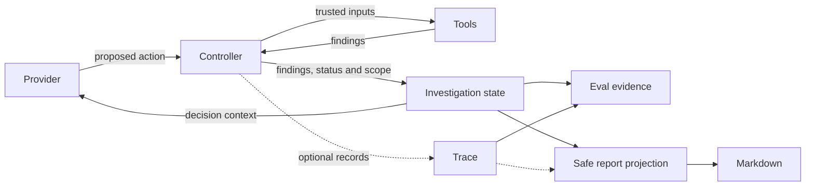

# Game QA Agent

The Agent chooses investigation actions through a provider. The controller validates
actions, builds trusted Tool inputs, and authorizes scope expansion from checker
findings. Deterministic checkers inspect task dependencies and NPC requirements.
Trace records optional execution diagnostics; Eval checks scripted expectations
against the real investigation path.

`build_qa_report(state, trace=None)` produces a typed `QAInvestigationReport` from
the resulting controller-owned state. `render_qa_report_markdown(report)` renders
that snapshot without executing the Agent, provider, or Tools.

## Offline report example

This example reuses the authorized dynamic-scope Eval scenario and real controller
and checkers. Its provider only returns the existing scripted actions. It does not
load environment files or construct a network provider. Run the Python block from
the repository root in an environment with Pydantic 2 and NetworkX installed.

```python
from collections import deque

from game_qa_agent import (
    InMemoryInvestigationTraceRecorder,
    build_default_tool_registry,
    build_deterministic_evaluation_cases,
    build_qa_report,
    build_task_index,
    render_qa_report_markdown,
    run_agent_investigation,
)


class OfflineProvider:
    def __init__(self, actions):
        self.actions = deque(actions)

    def generate_next_action(self, state):
        return self.actions.popleft()


case = next(
    case for case in build_deterministic_evaluation_cases()
    if case.case_id == "authorized_dynamic_scope_expansion"
)
trace = InMemoryInvestigationTraceRecorder()
state = run_agent_investigation(
    case.initial_state.model_copy(deep=True),
    build_default_tool_registry(),
    build_task_index(case.tasks),
    case.runtime_state,
    OfflineProvider(case.scripted_actions),
    max_steps=case.max_steps,
    trace_recorder=trace,
)
print(render_qa_report_markdown(build_qa_report(state, trace)), end="")
```

The report tests execute this example and compare its complete output:

```markdown
# QA investigation report

Status: `finished`.

Trusted scope (version 2): `task_a`, `task_b`, `task_event_7`.

Findings: 3 recorded; 0 unrecognized.
Decision errors: 0.

## Findings

Type | Count
--- | ---
NPC location mismatch | 1
NPC occupied by another task | 1
Potential NPC conflict (static risk) | 1

Scoped details (one row per recorded recognized finding):

Type | Tasks in scope | Other task references | NPC references
--- | --- | --- | ---
NPC location mismatch | `task_b` | 0 | 1
NPC occupied by another task | `task_b`, `task_event_7` | 0 | 1
Potential NPC conflict (static risk) | `task_b`, `task_event_7` | 0 | 1

## Trace

Recorded steps: 4; final status: `finished`; rejected steps: 0; scope changes: 1.

- Step 2: scope 1 -> 2; added `task_event_7`.

## Limitations

- Counts reflect recorded findings; full checker coverage is not established.
- A potential NPC conflict is a static risk, not proof of a runtime conflict.
- Trace is diagnostic and may omit steps.
```

## Report contract and boundaries

The report captures normalized investigation status, sorted trusted scope and scope
version, total recorded findings, recognized issue-type counts, safe per-finding
references, unrecognized-finding count, decision-error count, and fixed limitation
codes. An optional Trace summary adds recorded step count, final status, rejected
step count, and scope-version changes with added IDs filtered to the final scope.
Unrecognized status text becomes `unknown`; missing or inconsistent Trace final
status is reported without changing the investigation status.

Only the seven existing issue types paired with their expected checker names get
details. Per-finding task IDs must belong to `state.scope_task_ids`. Other task IDs
and NPC IDs become distinct reference counts per finding. These are counts of the
issue's ID lists, not counts extracted from its evidence dictionary. There is no
complete current-scope NPC allowlist in the existing state, so NPC names are not
exported. Checker messages and all evidence values, including locations, runtime
states and missing dependency IDs, are omitted. Unknown issue/checker pairs stay
in the total and unrecognized counts without exporting their labels or payloads.

Provider reasons, prompts/completions, raw actions and Tool arguments/results,
decision-error strings, candidate expansion IDs, and environment data are never
copied. The only variable text exported from inputs is the controller's current
trusted task IDs. Markdown keeps those labels inside single-line code spans.
This boundary assumes controller-owned state and a recorder from the same run;
it does not authenticate forged state or identify secrets placed inside trusted
task IDs. Trace has no run identifier and may be incomplete because recording
failures do not affect investigation execution.

The report preserves recorded finding multiplicity, even when omitted payloads
make two projected details identical. It does not infer severity, root cause,
checker coverage, or QA pass/fail. `finished` records an Agent stop; a potential NPC
conflict remains a static risk. Clarification, human review, step exhaustion, and
unfinished or unknown statuses have explicit limitations. Findings lack per-issue
scope-version provenance, so details are filtered against the final trusted scope.

The implementation copies collections and performs no I/O. Output uses stable
ordering and LF newlines without timestamps. It adds a downstream consumer only:
Agent/controller/Tool, provider, scope, Trace and Eval behavior are unchanged.



## Verification and project discussion

Run `python -m pytest -q tests/test_report.py` for the report checks and
`python -m pytest -q` for the complete deterministic offline suite, using an
interpreter with pytest and the project dependencies installed. The tests reuse
the real scripted Eval scenarios, cover all seven checker types, preserve input
state and Trace, exercise hostile payloads, and execute the README example.

The example supports a reproducible demo of three recorded findings and one
authorized scope expansion. A supported resume statement is: "Implemented typed,
deterministic QA investigation reports with scoped finding projections, optional
Trace summaries, and offline privacy and regression tests." For an interview,
the code and tests support discussion of scope authorization, static risk versus
runtime observations, report privacy, and separation of execution from reporting.
They do not establish live-provider quality, production readiness, or QA coverage.
